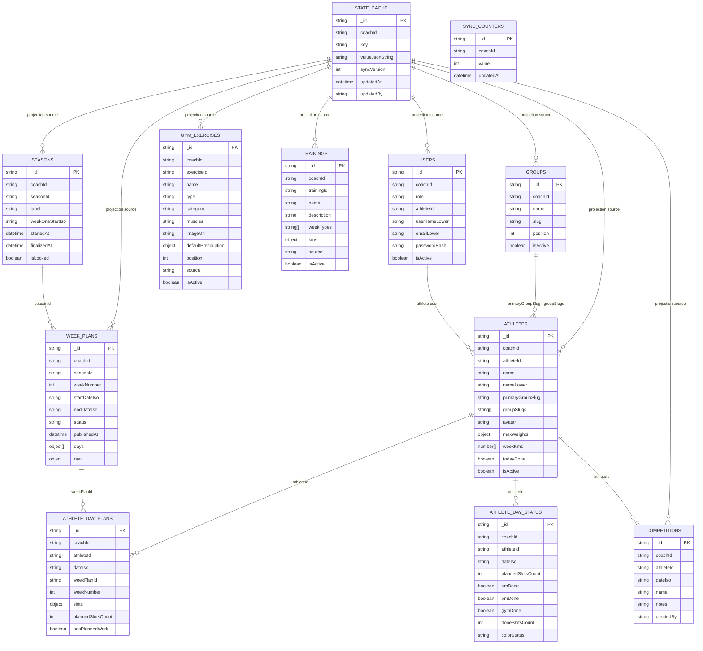
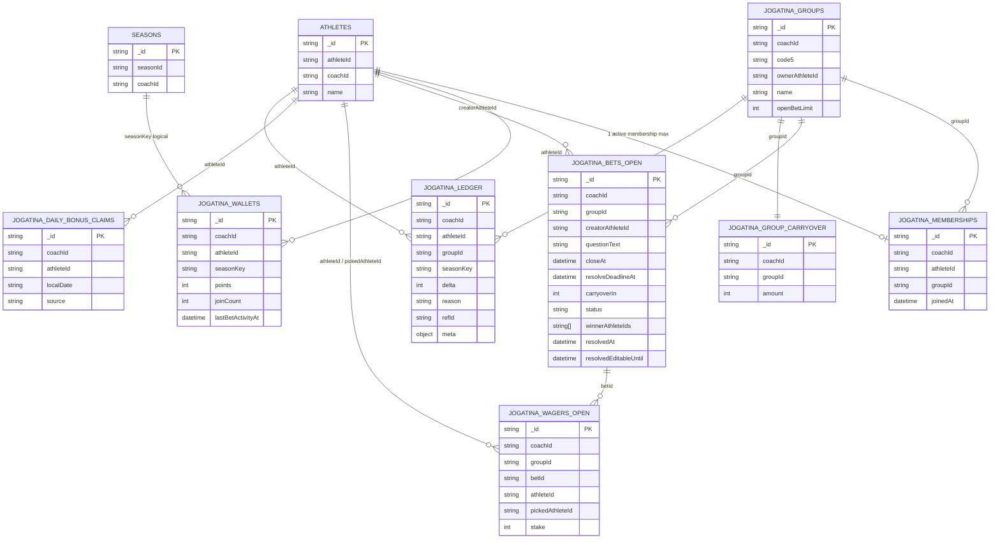

# TrackFlow Data Model

Este documento resume el modelo de datos actual de la web y la expansion de `Jogatina`.

## High-Level Flow

```mermaid
flowchart LR
  WEB[Web TrackFlow] --> AUTH[/api/auth]
  WEB --> STORAGE[/api/storage]
  WEB --> DOMAIN[/api]
  WEB --> JOGATINA[/api/jogatina]

  STORAGE --> STATE_CACHE[(state_cache)]
  STORAGE --> SYNC[(sync_counters)]

  STATE_CACHE --> USERS[(users)]
  STATE_CACHE --> GROUPS[(groups)]
  STATE_CACHE --> ATHLETES[(athletes)]
  STATE_CACHE --> GYM[(gym_exercises)]
  STATE_CACHE --> TRAININGS[(trainings)]
  STATE_CACHE --> SEASONS[(seasons)]
  STATE_CACHE --> WEEKS[(week_plans)]
  STATE_CACHE --> DAYPLANS[(athlete_day_plans)]
  STATE_CACHE --> DAYSTATUS[(athlete_day_status)]
  STATE_CACHE --> COMPS[(competitions)]

  DOMAIN --> DAYSTATUS
  DOMAIN --> COMPS
  JOGATINA --> JG[(jogatina_groups)]
  JOGATINA --> JM[(jogatina_memberships)]
  JOGATINA --> JW[(jogatina_wallets)]
  JOGATINA --> JB[(jogatina_bets_open)]
  JOGATINA --> JWG[(jogatina_wagers_open)]
  JOGATINA --> JC[(jogatina_group_carryover)]
  JOGATINA --> JBC[(jogatina_daily_bonus_claims)]
  JOGATINA --> JL[(jogatina_ledger)]

  DAYSTATUS -. daily bonus .-> JOGATINA
```

## Core Collections



## Jogatina Collections



## Notes

- `coachId` es la particion principal del sistema. Casi todas las colecciones quedan scopeadas por entrenador.
- `state_cache` guarda el estado bruto tipo key-value y desde ahi se proyectan las colecciones operativas Mongo.
- `athlete_day_plans` y `athlete_day_status` separan plan previsto de ejecucion real.
- `jogatina_bets_open` y `jogatina_wagers_open` solo guardan apuestas activas. Al finalizar se purgan y se conserva trazabilidad en `jogatina_ledger`.
- `jogatina_wallets` maneja saldo por `seasonKey`, no saldo global historico.
